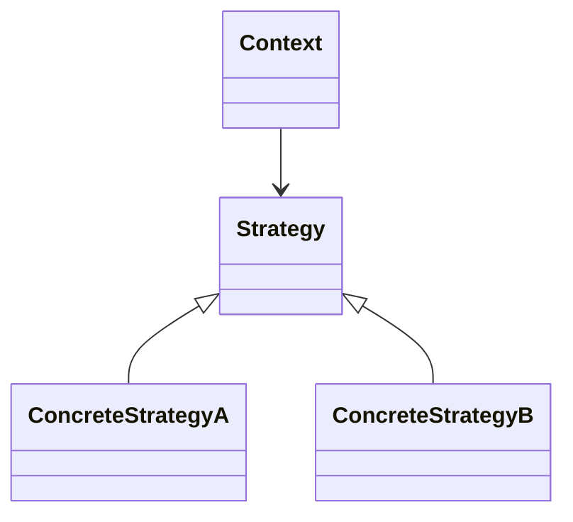

# Strategy Design Pattern

The **Strategy Design Pattern** is a behavioral design pattern that enables selecting an algorithm's behavior at runtime. It defines a family of algorithms, encapsulates each one in a separate class, and makes them interchangeable. This approach promotes flexibility and cleaner code by separating the algorithm implementation from the context in which it is used.

## When to Use

Use the Strategy Pattern when:
- A class performs similar operations in different ways.
- You want to avoid large conditional statements for selecting behaviors.
- You need to switch between algorithms or behaviors dynamically at runtime.

## Structure

## Key Components

- **Strategy**: Interface for all supported algorithms.
- **ConcreteStrategy**: Classes that implement the Strategy interface with specific algorithms.
- **Context**: Maintains a reference to a Strategy object and allows changing it at runtime.
- **Client**: Configures the Context with a ConcreteStrategy.

> **Note:**  
> - Each strategy is defined in its own class implementing the Strategy interface.  
> - Concrete strategies provide specific implementations.  
> - The Context class uses a strategy and provides methods to set or get the current strategy.  
> - The client selects and assigns the desired strategy to the context.

---

> **Note:**
> - Reference from: [Refactoring Guru](https://refactoring.guru/design-patterns/strategy)